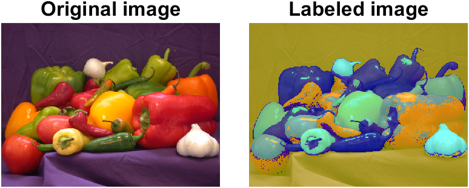

# Image color segmentation
 

# Labeled images:
## 📊 Color Picking Results

### Segmentation Maps

| Dataset      | RGB                                                             | HSV                                                             | LAB                                                             |
|--------------|-----------------------------------------------------------------|-----------------------------------------------------------------|-----------------------------------------------------------------|
| **alligator1**   |    |    |    |
| **alligator28**  |   |   |   |
| **fabric**       |        |        |        |
| **hestain**      |       |       |       |
| **peppers**      |       |       |       |
| **thin39**       |        |        |        |

### Pixel Distributions

| Dataset      | RGB                                                                 | HSV                                                                 | LAB                                                                 |
|--------------|----------------------------------------------------------------------|----------------------------------------------------------------------|----------------------------------------------------------------------|
| **alligator1**   |   |   |   |
| **alligator28**  |  |  |  |
| **fabric**       |       |       |       |
| **hestain**      |      |      |      |
| **peppers**      |      |      |      |
| **thin39**       |       |       |       |

## 🎨 K-means Clustering Results

### Cluster Centroids Visualizations

### Segmentation Maps after Clustering

| Dataset      | RGB (k-means)                                                        | HSV (k-means)                                                        | LAB (k-means)                                                        |
|--------------|-----------------------------------------------------------------------|-----------------------------------------------------------------------|-----------------------------------------------------------------------|
| **alligator1**   |   |   |   |
| **alligator28**  |  |  |  |
| **fabric**       |       |       |       |
| **hestain**      |      |      |      |
| **peppers**      |      |      |      |
| **thin39**       |       |       |       |

| Dataset      | RGB (k-means)                                                        | HSV (k-means)                                                        | LAB (k-means)                                                        |
|--------------|-----------------------------------------------------------------------|-----------------------------------------------------------------------|-----------------------------------------------------------------------|
| **alligator1**   |  |  |  |
| **alligator28**  | | | |
| **fabric**       |      |      |      |
| **hestain**      |     |     |     |
| **peppers**      |     |     |     |
| **thin39**       |      |      |      |

# Requirements
MATLAB  
Image Processing Toolbox  
Statistics and Machine Learning Toolbox

# Feedback
Please rate and provide feedback for the further improvements.
